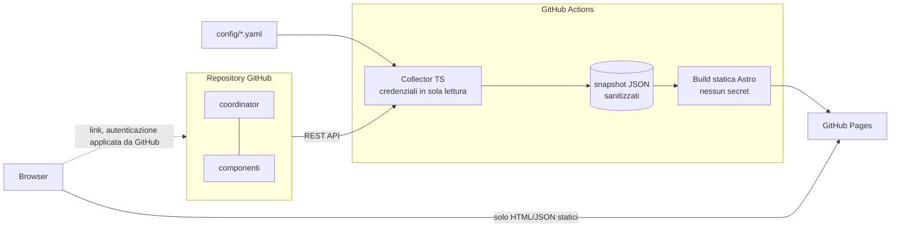

# Engineering Project Hub

> 🇬🇧 English version: [README.md](README.md)

Un **portale statico e GitHub-native** che mostra i progetti software composti da molti
repository GitHub come **un'unica unità logica**: stato del delivery, versioni e drift,
release, ambienti, alert di sicurezza, copertura di sicurezza, governance e qualità dei dati.

Gira interamente su GitHub: un **collector** TypeScript eseguito in GitHub Actions legge
l'API di GitHub con credenziali in sola lettura e scrive **snapshot JSON sanitizzati**; un
sito statico **Astro**, generato a partire da quegli snapshot, viene pubblicato su
**GitHub Pages**. Il browser non chiama mai l'API di GitHub e il sito non ha né backend né
database.

| Campo                 | Valore                                                                       |
| --------------------- | ---------------------------------------------------------------------------- |
| **Progetto**          | Engineering Project Hub (nome provvisorio), MVP                              |
| **Ambito del modulo** | Repository singolo: collector + sito statico                                 |
| **Repository**        | https://github.com/massimilianolapuma/engineering-project-hub                |
| **Demo online**       | https://massimilianolapuma.github.io/engineering-project-hub/ (dati mock)    |
| **Ambienti target**   | GitHub Pages (statico). Nessun server a runtime.                             |
| **Stato**             | MVP. Funziona subito con dati mock; la modalità GitHub richiede credenziali. |

---

## Indice

- [A quali domande risponde](#a-quali-domande-risponde)
- [Viste](#viste)
- [Architettura](#architettura)
- [Prerequisiti](#prerequisiti)
- [Avvio rapido (modalità mock)](#avvio-rapido-modalità-mock)
- [Modalità GitHub](#modalità-github)
- [Configurazione](#configurazione)
- [Autenticazione: GitHub App (consigliata)](#autenticazione-github-app-consigliata)
- [Autenticazione: token di fallback](#autenticazione-token-di-fallback)
- [GitHub Pages](#github-pages)
- [Workflow CI/CD](#workflow-cicd)
- [Test](#test)
- [Risoluzione dei problemi](#risoluzione-dei-problemi)
- [Limitazioni dell'MVP](#limitazioni-dellmvp)
- [Roadmap](#roadmap)
- [Ipotesi e decisioni](#ipotesi-e-decisioni)

## A quali domande risponde

- Qual è lo stato complessivo di ogni progetto, e **perché**: ogni dimensione di salute è
  mostrata separatamente e lo stato complessivo non viene mai mostrato senza le dimensioni
  che lo determinano.
- Quali repository e componenti compongono un progetto, e quale componente blocca la
  pipeline.
- La versione del coordinator, le versioni dichiarate dei componenti, le ultime release e
  gli SHA dei submodule, e se sono allineati.
- Quali workflow monitorati sono stati eseguiti, sono falliti o sono in esecuzione.
- Quale versione è dichiarata in esecuzione su ciascun ambiente.
- Gli alert di sicurezza aperti (code scanning, Dependabot, secret scanning) e, come
  **domanda separata**, quanto è completa la copertura di sicurezza.
- Quali repository non usano i workflow standard, quali scansioni non sono aggiornate e
  quali dati non è stato possibile leggere.

## Viste

Ogni vista è disponibile in **inglese** (`/`) e in **italiano** (`/it/`), in modalità chiara
e scura, con navigazione da tastiera e una legenda sempre visibile.

| Vista                  | Path              | Contenuto                                                                                                                                                                                                                                                                                                                                       |
| ---------------------- | ----------------- | ----------------------------------------------------------------------------------------------------------------------------------------------------------------------------------------------------------------------------------------------------------------------------------------------------------------------------------------------- |
| **Portfolio**          | `/`               | Tutti i progetti con stato complessivo, delivery, versioni, rischio sicurezza, copertura (% + obbligatori/disponibili), conteggi Critical / High / secret, workflow critici falliti, ultimo aggiornamento con indicatore di dato non aggiornato, errori di raccolta. Ricerca, filtri (salute, business unit, lifecycle, severità), ordinamento. |
| **Dettaglio progetto** | `/projects/<id>/` | Informazioni generali, coordinator (versione e relativa fonte, ultima release, ultimo commit, manifest), riquadri di salute con i motivi, componenti (repository, versione dichiarata, ultima release, commit, SHA del submodule, drift), workflow, ambienti, riepilogo sicurezza, copertura, errori di raccolta.                               |
| **Workflow**           | `/workflows/`     | Matrice con i componenti come righe e i workflow monitorati come colonne. Ogni cella mostra stato, conclusione, branch, orario, link all'esecuzione, indicatore di dato non aggiornato e l'ultimo job/step fallito (mai i log).                                                                                                                 |
| **Versioni**           | `/versions/`      | Versione del coordinator, versioni dei componenti dichiarate rispetto a quelle rilasciate, SHA dei submodule e relative associazioni, versioni degli ambienti, drift e motivi di coerenza.                                                                                                                                                      |
| **Sicurezza**          | `/security/`      | KPI Critical / High / Medium / Low / secret, suddivisioni per categoria, severità, fonte, stato e repository, una matrice di copertura (repository × controllo), scansioni incomplete e non aggiornate, errori di autorizzazione e l'elenco sanitizzato dei finding.                                                                            |
| **Qualità dati**       | `/data-quality/`  | Metadati dell'esecuzione del collector, modalità di autenticazione, capability dell'API, repository OK / con errori / non disponibili, sorgenti non accessibili, sorgenti non aggiornate, submodule non risolti ed errori di raccolta classificati.                                                                                             |

Stati: 🔴 **Critical** (Critico), 🟠 **Attention** (Attenzione), 🟢 **Healthy** (Sano) e
⬜ **Unknown** (Sconosciuto). Ciascuno è mostrato con un colore, un'icona di forma distinta,
un testo e una descrizione accessibile. I dati sconosciuti sono mostrati come
**"—" / Unknown (Sconosciuto), mai come 0**. Il sito usa anche le etichette "Not configured"
(Non configurato), "Not authorised" (Non autorizzato), "No open alerts" (Nessun alert
aperto, mostrata solo quando la raccolta è riuscita) e "Collection failed" (Raccolta
fallita).

## Architettura



```text
config/            catalog (projects.yaml), policies (policies.yaml), generated JSON Schemas
shared/model/      Zod schemas + types: the single contract (catalog, policies, snapshot, contracts)
shared/security/   credential patterns used by the sanitiser and the output scanner
collector/src/     providers (GitHub, mock) → normalizers → evaluators → sanitizers → writers
src/               Astro site (pages, components, i18n EN/IT, styles, client scripts)
fixtures/          synthetic provider fixtures (github/) and golden snapshots (snapshots/)
scripts/           validate-config, validate-snapshots, scan-output, golden/schema generators
tests/             unit, integration (collector + site build), e2e (Playwright)
docs/              architecture, security, configuration, operations, ADRs (EN + docs/it/)
```

Per i dettagli vedi [docs/it/architecture.md](docs/it/architecture.md).

## Prerequisiti

- Node.js **24 LTS** (`.nvmrc`); è supportato `>=22.12`.
- npm 10+.
- Opzionale: Playwright Chromium per i test e2e (`npx playwright install chromium`).
- Opzionale: `actionlint`, `zizmor` e `act` con **podman** per verificare i workflow in
  locale.

## Avvio rapido (modalità mock)

La build locale predefinita usa **dati mock sintetici** e non richiede credenziali.

```bash
npm ci
npm run build          # collect (mock) → validate snapshots → astro build → secret scan
npm run preview        # http://localhost:4321  (Italian: /it/)
```

Server di sviluppo con hot reload:

```bash
npm run collect:mock   # writes public/data/ (index.json, projects/*.json, collection-report.*)
npm run dev
```

I dati mock coprono tre progetti fittizi di `example-org`:

- **Project Alpha**: workflow verdi, PROD indietro rispetto alla release, un alert
  Dependabot High, drift di versione del frontend, copertura parziale (container scanning
  non configurato su un repository).
- **Project Beta**: CI critica fallita sull'API, un alert di code scanning Critical in un
  repository privato (dettagli omessi), secret scanning non autorizzato, un file di stato
  sicurezza e un'esecuzione di deployment non aggiornati, un workflow standard mancante e un
  submodule non associato.
- **Project Gamma**: repository non accessibili, quindi ogni dimensione è Unknown
  (Sconosciuto).

I timestamp mock sono relativi (`@now-2h`), così la demo mantiene nel tempo il livello di
aggiornamento previsto.

## Modalità GitHub

```bash
export DATA_SOURCE=github
export GH_READ_TOKEN=...            # or the GitHub App variables, see below
npm run build
# or run only the collector
npm run collect:github
```

La priorità delle credenziali è: **GitHub App** (tutte e tre le variabili) →
`GH_READ_TOKEN` → `GITHUB_TOKEN`. **Non esiste alcun fallback silenzioso**. Una App
configurata solo in parte, oppure `DATA_SOURCE=github` senza credenziali, interrompe
l'esecuzione con un errore esplicito. I dati mock sono usati solo con `DATA_SOURCE=mock`
(il valore predefinito).

Gli errori sui singoli repository (403, 404, rate limit) **non** interrompono l'esecuzione.
Vengono registrati come errori di raccolta classificati e mostrati come Unknown
(Sconosciuto) o Not authorised (Non autorizzato). Non vengono mai trattati come "nessun
problema".

## Configurazione

- `config/projects.yaml` è il **catalogo**: progetti, coordinator, componenti, path dei
  submodule, ambienti, workflow monitorati (critici o meno, `appliesTo`) e controlli di
  sicurezza obbligatori od opzionali. Le associazioni sono esplicite e non vengono mai
  dedotte dai nomi dei repository.
- `config/policies.yaml` contiene le **policy di salute**: soglie, criteri di dato non
  aggiornato, quali severità rendono la sicurezza rossa o ambra, dimensioni critiche e
  obbligatorie, e il pubblico di pubblicazione.

Per aggiungere un progetto, aggiungi una voce a `projects.yaml`, poi esegui
`npm run validate:config`. Non serve modificare codice. Anche le policy si modificano senza
toccare il codice o il frontend. Vedi [docs/it/configuration.md](docs/it/configuration.md).

Contratti opzionali letti dai repository monitorati:

- `release-manifest.yaml` nel coordinator: versione del coordinator, versioni attese dei
  componenti e versioni per ambiente.
- `.security/project-security-status.json` in ogni repository: risultati di container e
  IaC scanning, DAST, SBOM e firma degli artifact prodotti dalle pipeline.

Gli JSON Schema per editor e consumer si trovano in `config/schema/` e sono generati con
`npm run schema:generate`.

## Autenticazione: GitHub App (consigliata)

Crea una GitHub App di proprietà dell'organizzazione e **installala solo sui repository
monitorati**. Assegnale questi permessi di repository **in sola lettura**. I nomi sono stati
verificati sulla documentazione GitHub il 2026-10-03.

| Permesso (UI)          | Chiave API               | Usato per                                                           |
| ---------------------- | ------------------------ | ------------------------------------------------------------------- |
| Metadata               | `metadata`               | metadati del repository, tag (obbligatorio, sola lettura)           |
| Contents               | `contents`               | head del branch, release, `.gitmodules`, manifest, file di stato    |
| Actions                | `actions`                | esecuzioni e job dei workflow (elenca anche gli ambienti, se usati) |
| Code scanning alerts   | `security_events`        | alert e analisi di code scanning                                    |
| Dependabot alerts      | `vulnerability_alerts`   | alert Dependabot                                                    |
| Secret scanning alerts | `secret_scanning_alerts` | alert di secret scanning (recuperati con `hide_secret=true`)        |
| Deployments            | `deployments`            | _non usato dall'MVP_ (roadmap)                                      |

Non concedere alcun permesso di scrittura, né permessi Environments, Pages o di
organizzazione. Poi aggiungi a questo repository questi **Actions secrets** di repository:
`GH_APP_ID`, `GH_APP_PRIVATE_KEY` (il PEM) e `GH_APP_INSTALLATION_ID`.

## Autenticazione: token di fallback

Solo per l'MVP, puoi usare un **fine-grained personal access token** nel secret
`GH_READ_TOKEN`. Limitalo ai repository monitorati, assegnagli i permessi in sola lettura
elencati sopra e imposta una scadenza breve. `GITHUB_TOKEN` è l'ultimo fallback: può
leggere solo questo repository, quindi gli altri repository risultano Not authorised (Non
autorizzato). Lo snapshot registra quale modalità di autenticazione è stata usata.

## GitHub Pages

1. **Settings → Pages → Build and deployment → Source: GitHub Actions**.
2. **Settings → Environments → `github-pages`**: limita i deployment a `main`.
3. Imposta la **variabile** di repository `DATA_SOURCE` (`mock` per impostazione
   predefinita, oppure `github`) e i secret indicati sopra.

`deploy-pages.yml` viene eseguito a intervalli pianificati (ogni 6 ore), al push su `main`
e su richiesta.

> ⚠️ **Visibilità.** Un sito GitHub Pages è leggibile da chiunque, a meno che il tuo piano
> non supporti le Pages private (GitHub Enterprise Cloud con controllo degli accessi). Con
> `publication.audience: public` (il valore predefinito), titoli e rule id dei finding nei
> repository non pubblici vengono omessi, ma nomi dei repository, conteggi e stati sono
> comunque pubblicati. Leggi [docs/it/security.md](docs/it/security.md) prima di puntare il
> collector su repository privati.

## Workflow CI/CD

I workflow chiamanti usano i mattoni riusabili `rw-*` di questo repository (qualità Node,
build e test, e2e Playwright, actionlint, zizmor, Trivy, lint del titolo PR, deploy Pages).
Vedi
[docs/it/ci/workflows.md](docs/it/ci/workflows.md) e
[ADR 0003](docs/it/architecture/adr/0003-ci-building-blocks-and-collect-deploy-split.md).

| Workflow           | Trigger                                         | Cosa fa                                                                                                                                                                          |
| ------------------ | ----------------------------------------------- | -------------------------------------------------------------------------------------------------------------------------------------------------------------------------------- |
| `ci.yml`           | pull request, push su `main`                    | Lint del titolo della PR, ESLint / tsc / astro check / Prettier, build mock e test con coverage, secret scan dell'output, e2e Playwright, actionlint, zizmor e Trivy (SARIF)     |
| `collect-data.yml` | `workflow_call`, manuale, `repository_dispatch` | Valida il catalogo, raccoglie i dati (mock o GitHub), valida gli snapshot, scrive un job summary e carica l'artifact `snapshots` (14 giorni). È l'**unico** job con credenziali. |
| `deploy-pages.yml` | pianificato, push su `main`, manuale            | `collect` → `build` (nessun secret; base path da configure-pages; secret scan) → `deploy` (OIDC, `pages: write`)                                                                 |

Comandi locali:

| Attività                    | Comando                                                            |
| --------------------------- | ------------------------------------------------------------------ |
| Installazione               | `npm ci`                                                           |
| Server di sviluppo          | `npm run collect:mock && npm run dev`                              |
| Collector (mock)            | `npm run collect:mock`                                             |
| Collector (GitHub)          | `DATA_SOURCE=github GH_READ_TOKEN=… npm run collect:github`        |
| Validazione config          | `npm run validate:config`                                          |
| Validazione snapshot        | `npm run validate:snapshots`                                       |
| Lint / formattazione / tipi | `npm run lint` · `npm run format:check` · `npm run typecheck`      |
| Test                        | `npm test` (unit + integration) · `npm run ci:test` (con coverage) |
| E2E                         | `npm run build && npm run test:e2e`                                |
| Build                       | `npm run build`                                                    |
| Anteprima                   | `npm run preview`                                                  |
| Secret scan dell'output     | `npm run scan:output`                                              |
| Rigenerazione dei golden    | `npm run fixtures:update`                                          |

## Test

- **Unit**: validazione di catalogo e policy, normalizzazione di severità e stati,
  evaluator di delivery, sicurezza, copertura, versioni, governance e stato complessivo,
  parsing di `.gitmodules`, associazione tra repository e componenti, drift di versione,
  sanitizer (canary `ghp_exampleSecretValue`, `github_pat_exampleSecretValue`,
  `Bearer example-token`, `PRIVATE KEY`, `password=example`), classificazione degli errori
  GitHub (403, 404 e rate limit), il provider GitHub contro un `fetch` fittizio, priorità
  dell'autenticazione e parità delle chiavi i18n.
- **Integration**: il collector mock riproduce gli snapshot golden, gli scenari demo
  previsti, i dati parziali, un provider avvelenato con canary che non pubblica nulla di
  sensibile, l'allowlist (campi sconosciuti rifiutati) e uno `schemaVersion` non
  supportato. Una build Astro reale verifica ogni vista in EN e IT, i link a GitHub, che un
  valore sconosciuto non sia mai mostrato come 0, che non ci siano script inline e che non
  compaiano pattern di secret.
- **E2E** (Playwright, desktop e mobile): portfolio, filtri da tastiera, navigazione in
  entrambe le lingue e dettaglio progetto.

## Risoluzione dei problemi

| Sintomo                                                                        | Causa / soluzione                                                                                                                                          |
| ------------------------------------------------------------------------------ | ---------------------------------------------------------------------------------------------------------------------------------------------------------- |
| `Invalid configuration in config/projects.yaml: …`                             | Validazione Zod. Il messaggio indica il path esatto, ad esempio `projects[0].components[1].repository`.                                                    |
| `DATA_SOURCE=github but no credentials found`                                  | Imposta i secret della GitHub App o `GH_READ_TOKEN`, oppure usa `DATA_SOURCE=mock`.                                                                        |
| `GitHub App credentials are incomplete`                                        | Sono richieste tutte e tre le variabili `GH_APP_*`. Per scelta progettuale non c'è fallback.                                                               |
| La pagina mostra **Snapshot data unavailable** (Dati snapshot non disponibili) | Snapshot assente o non valido, oppure `schemaVersion` non supportato. Esegui `npm run collect:mock` o `validate:snapshots`.                                |
| Molte voci **Not authorised** (Non autorizzato)                                | Permesso o installazione della App mancante, oppure `GITHUB_TOKEN` usato per altri repository. Controlla la pagina Qualità dati.                           |
| Molti errori **Rate limited**                                                  | Riduci la frequenza della pianificazione o il numero di repository, oppure usa una GitHub App (limiti più alti). Vedi [operations](docs/it/operations.md). |
| `Sanitisation gate failed for …`                                               | Un pattern simile a una credenziale ha raggiunto l'output. Non è stato scritto nulla. Analizza il campo di origine.                                        |
| Il deploy fallisce su `configure-pages`                                        | Pages non abilitato, oppure Source non impostata su **GitHub Actions**.                                                                                    |

## Limitazioni dell'MVP

- GitHub Pages è **hosting statico**: il sito non applica alcuna autorizzazione per utente
  o per alert.
- I link agli alert puntano a GitHub, che applica i propri permessi. Il portale non
  aggira mai i permessi di GitHub.
- **Nessun alert non significa nessuna vulnerabilità.** La copertura dipende dai controlli
  effettivamente configurati, e gli alert GitHub riflettono solo ciò che restituiscono le
  API disponibili (fino a 300 alert per fonte e per repository).
- I risultati degli scanner esterni richiedono il contratto esplicito
  `.security/project-security-status.json`.
- Le versioni degli ambienti provengono dal release manifest del coordinator, che è
  dichiarativo. Per la versione effettivamente in esecuzione servono integrazioni future
  come Argo CD. Gli environment di GitHub da soli non identificano la versione a runtime.
- "Ultimo tag" (usato quando non c'è una release) segue l'ordine dell'API, non semver.
- Gli snapshot non devono contenere dati riservati. Una Page pubblica non deve esporre
  dettagli tecnici di repository privati (vedi `publication.audience`).
- Le GitHub Pages private dipendono dal piano GitHub effettivo. Verificalo prima di andare
  in produzione.
- Sono implementati solo i provider GitHub e mock.

## Roadmap

Sono predisposti ma non implementati: discovery tramite custom properties e topic;
provider Harbor, SonarQube, Trivy, Checkov, ZAP, SBOM (CycloneDX/SPDX), Cosign e Argo CD;
notifiche Azure DevOps, Jira e Microsoft Teams; Prometheus/Grafana; storico e trend;
eccezioni di sicurezza con scadenza; policy-as-code; scorecard dei repository; controlli
sulle versioni dei reusable workflow, sulle action fissate a SHA e sulla branch
protection / sui ruleset; SLA di remediation; export CSV; una vista executive sanitizzata.
I punti di estensione sono `SourceProvider` e `ControlProvider` in
`collector/src/providers/types.ts`.

## Ipotesi e decisioni

- Stack: TypeScript, Astro 7 (output statico), Zod 4, Octokit, Vitest, ESLint, Prettier,
  CSS nativo, npm. TypeScript è fissato alla **6.0** perché typescript-eslint e
  `@astrojs/check` non supportano ancora TS 7.
- La demo pubblica usa **solo dati mock**: il sito è leggibile da chiunque, quindi non mostra
  mai dati di repository reali (privati).
- Collector e sito sono separati. Condividono solo il contratto `shared/model`.
- Raccolta e deploy sono workflow separati, concatenati tramite un reusable workflow, così
  i secret restano in un solo job
  ([ADR 0003](docs/it/architecture/adr/0003-ci-building-blocks-and-collect-deploy-split.md)).
- Il pubblico di pubblicazione è `public` per impostazione predefinita, quindi sicuro by
  default.
- Vedi [ADR 0001](docs/it/architecture/adr/0001-static-first-github-native.md) e
  [ADR 0002](docs/it/architecture/adr/0002-snapshot-contract-and-provider-abstraction.md).

## Conformità e sicurezza

Vedi [SECURITY.md](SECURITY.md) e [docs/it/security.md](docs/it/security.md). Il portale è
in **sola lettura**. Non scrive mai su repository, alert o workflow, non chiude mai alert e
non avvia mai workflow nei repository monitorati.

## Licenza

[MIT](LICENSE).
