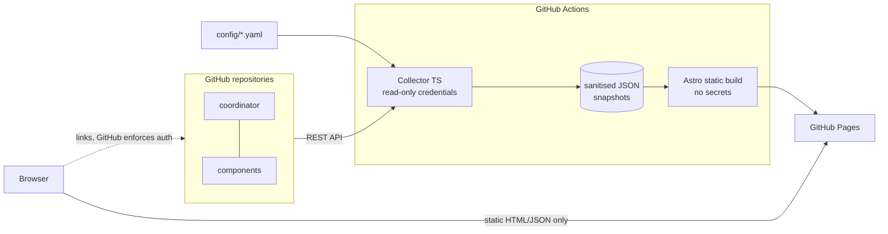

# Engineering Project Hub

> 🇮🇹 Versione italiana: [README.it.md](README.it.md)

A **static, GitHub-native portal** that shows software projects made of many GitHub
repositories as **one logical unit**: delivery status, versions and drift, releases,
environments, security alerts, security coverage, governance and data quality.

It runs entirely on GitHub: a TypeScript **collector** runs in GitHub Actions, reads the
GitHub API with read-only credentials, writes **sanitised JSON snapshots**, and an
**Astro** static site built from those snapshots is published to **GitHub Pages**.
The browser never calls the GitHub API, and the site has no backend and no database.

| Field                   | Value                                                                     |
| ----------------------- | ------------------------------------------------------------------------- |
| **Project**             | Engineering Project Hub (working name), MVP                               |
| **Module scope**        | Single repository: collector + static site                                |
| **Repository**          | https://github.com/massimilianolapuma/engineering-project-hub             |
| **Live demo**           | https://massimilianolapuma.github.io/engineering-project-hub/ (mock data) |
| **Target environments** | GitHub Pages (static). No runtime servers.                                |
| **Status**              | MVP. Works with mock data out of the box; GitHub mode needs credentials.  |

---

## Contents

- [What it answers](#what-it-answers)
- [Views](#views)
- [Architecture](#architecture)
- [Prerequisites](#prerequisites)
- [Quick start (mock mode)](#quick-start-mock-mode)
- [GitHub mode](#github-mode)
- [Configuration](#configuration)
- [Authentication: GitHub App (preferred)](#authentication-github-app-preferred)
- [Authentication: fallback token](#authentication-fallback-token)
- [GitHub Pages](#github-pages)
- [CI/CD workflows](#cicd-workflows)
- [Tests](#tests)
- [Troubleshooting](#troubleshooting)
- [MVP limitations](#mvp-limitations)
- [Roadmap](#roadmap)
- [Assumptions and decisions](#assumptions-and-decisions)

## What it answers

- What is the overall state of each project, and **why**: every health dimension is shown
  separately, and the overall state is never shown without the dimensions behind it.
- Which repositories and components make up a project, and which component blocks the
  pipeline.
- The coordinator version, the declared component versions, the latest releases and
  submodule SHAs, and whether they are aligned.
- Which tracked workflows ran, failed or are running.
- Which version each environment is declared to run.
- Open security alerts (code scanning, Dependabot, secret scanning) and, as a **separate
  question**, how complete the security coverage is.
- Which repositories do not use the standard workflows, which scans are stale, and which
  data could not be read.

## Views

Every view is available in **English** (`/`) and **Italian** (`/it/`), in light and dark
mode, with keyboard navigation and a legend that is always shown.

| View               | Path              | Content                                                                                                                                                                                                                                                                              |
| ------------------ | ----------------- | ------------------------------------------------------------------------------------------------------------------------------------------------------------------------------------------------------------------------------------------------------------------------------------ |
| **Portfolio**      | `/`               | All projects with overall, delivery, version, security risk, coverage (% + required/available), Critical / High / secret counts, failed critical workflows, last update with stale flag, collection errors. Search, filters (health, business unit, lifecycle, severity), sorting.   |
| **Project detail** | `/projects/<id>/` | General info, coordinator (version and source, latest release, latest commit, manifest), health tiles with reasons, components (repository, declared version, latest release, commit, submodule SHA, drift), workflows, environments, security summary, coverage, collection errors. |
| **Workflows**      | `/workflows/`     | Matrix with components as rows and tracked workflows as columns. Each cell shows the state, conclusion, branch, time, link to the run, stale flag and the last failed job/step (never logs).                                                                                         |
| **Versions**       | `/versions/`      | Coordinator version, declared versus released component versions, submodule SHAs and associations, environment versions, drift and consistency reasons.                                                                                                                              |
| **Security**       | `/security/`      | Critical / High / Medium / Low / secret KPIs, breakdowns by category, severity, source, status and repository, a coverage matrix (repository × control), incomplete and stale scans, authorisation errors, and the sanitised findings list.                                          |
| **Data quality**   | `/data-quality/`  | Collector run metadata, authentication mode, API capabilities, repositories OK / with errors / unavailable, inaccessible sources, stale sources, unresolved submodules, and classified collection errors.                                                                            |

Statuses: 🔴 **Critical**, 🟠 **Attention**, 🟢 **Healthy** and ⬜ **Unknown**. Each one is
shown with a colour, a distinct shape icon, text and an accessible description.
Unknown data is shown as **"—" / Unknown, never as 0**. The site also uses the labels "Not configured",
"Not authorised", "No open alerts" (only shown when collection succeeded) and "Collection
failed".

## Architecture



```text
config/            catalog (projects.yaml), policies (policies.yaml), generated JSON Schemas
shared/model/      Zod schemas + types: the single contract (catalog, policies, snapshot, contracts)
shared/security/   credential patterns used by the sanitiser and the output scanner
collector/src/     providers (GitHub, mock) → normalizers → evaluators → sanitizers → writers
src/               Astro site (pages, components, i18n EN/IT, styles, client scripts)
fixtures/          synthetic provider fixtures (github/) and golden snapshots (snapshots/)
scripts/           validate-config, validate-snapshots, scan-output, golden/schema generators
tests/             unit, integration (collector + site build), e2e (Playwright)
docs/              architecture, security, configuration, operations, ADRs (EN + docs/it/)
```

For details see [docs/architecture.md](docs/architecture.md).

## Prerequisites

- Node.js **24 LTS** (`.nvmrc`); `>=22.12` is supported.
- npm 10+.
- Optional: Playwright Chromium for e2e tests (`npx playwright install chromium`).
- Optional: `actionlint`, `zizmor`, and `act` with **podman** to check workflows locally.

## Quick start (mock mode)

The default local build uses **synthetic mock data** and needs no credentials.

```bash
npm ci
npm run build          # collect (mock) → validate snapshots → astro build → secret scan
npm run preview        # http://localhost:4321  (Italian: /it/)
```

Development server with hot reload:

```bash
npm run collect:mock   # writes public/data/ (index.json, projects/*.json, collection-report.*)
npm run dev
```

The mock data covers three fictional projects of `example-org`:

- **Project Alpha**: workflows green, PROD behind the release, one High Dependabot alert,
  frontend version drift, partial coverage (container scanning not configured on one repo).
- **Project Beta**: critical CI failed on the API, one Critical code scanning alert in a
  private repository (details withheld), secret scanning not authorised, a stale security
  status file and deployment run, a missing standard workflow, and an unmapped submodule.
- **Project Gamma**: repositories not accessible, so every dimension is Unknown.

Mock timestamps are relative (`@now-2h`), so the demo keeps its intended freshness over
time.

## GitHub mode

```bash
export DATA_SOURCE=github
export GH_READ_TOKEN=...            # or the GitHub App variables, see below
npm run build
# or run only the collector
npm run collect:github
```

Credential priority is: **GitHub App** (all three variables) → `GH_READ_TOKEN` →
`GITHUB_TOKEN`. There is **no silent fallback**. A partially configured App, or
`DATA_SOURCE=github` without credentials, stops the run with an explicit error. Mock data
is used only when `DATA_SOURCE=mock` (the default).

Errors on individual repositories (403, 404, rate limit) do **not** stop the run. They are
recorded as classified collection errors and shown as Unknown or Not authorised. They are
never treated as "no problems".

## Configuration

- `config/projects.yaml` is the **catalog**: projects, coordinator, components, submodule
  paths, environments, tracked workflows (critical or not, `appliesTo`) and required or
  optional security controls. Associations are explicit, never inferred from repository
  names.
- `config/policies.yaml` holds the **health policies**: thresholds, staleness, which
  severities make security red or amber, critical and required dimensions, and the
  publication audience.

To add a project, add an entry to `projects.yaml`, then run `npm run validate:config`.
You do not need to change any code. Policies also change without touching code or the
frontend. See [docs/configuration.md](docs/configuration.md).

Optional contracts read from monitored repositories:

- `release-manifest.yaml` in the coordinator: coordinator version, expected component
  versions and per-environment versions.
- `.security/project-security-status.json` in each repository: results of container and
  IaC scanning, DAST, SBOM and artifact signature produced by pipelines.

JSON Schemas for editors and consumers are in `config/schema/`, generated with
`npm run schema:generate`.

## Authentication: GitHub App (preferred)

Create a GitHub App owned by the organisation and **install it only on the monitored
repositories**. Give it these **read-only** repository permissions. Names were checked
against the GitHub documentation on 2026-10-03.

| Permission (UI)        | API key                  | Used for                                                                                               |
| ---------------------- | ------------------------ | ------------------------------------------------------------------------------------------------------ |
| Metadata               | `metadata`               | repository metadata, tags (mandatory, read-only)                                                       |
| Contents               | `contents`               | branch head, releases, `.gitmodules`, manifest, status file, commit compare (submodule SHA vs release) |
| Actions                | `actions`                | workflow runs and jobs (also lists environments, if used)                                              |
| Code scanning alerts   | `security_events`        | code scanning alerts and analyses                                                                      |
| Dependabot alerts      | `vulnerability_alerts`   | Dependabot alerts                                                                                      |
| Secret scanning alerts | `secret_scanning_alerts` | secret scanning alerts (fetched with `hide_secret=true`)                                               |
| Deployments            | `deployments`            | _not used by the MVP_ (roadmap)                                                                        |

Do not grant any write permission, or Environments, Pages or organisation permissions.
Then add these repository **Actions secrets** to this repository: `GH_APP_ID`,
`GH_APP_PRIVATE_KEY` (the PEM) and `GH_APP_INSTALLATION_ID`.

## Authentication: fallback token

For the MVP only, you can use a **fine-grained personal access token** in the secret
`GH_READ_TOKEN`. Limit it to the monitored repositories, give it the read-only permissions
listed above, and set a short expiry. `GITHUB_TOKEN` is the last fallback. It can only read
this repository, so other repositories show up as Not authorised. The snapshot records
which authentication mode was used.

## GitHub Pages

1. **Settings → Pages → Build and deployment → Source: GitHub Actions**.
2. **Settings → Environments → `github-pages`**: restrict deployments to `main`.
3. Set the repository **variable** `DATA_SOURCE` (`mock` by default, or `github`) and the
   secrets above.

`deploy-pages.yml` runs on a schedule (every 6 hours), on push to `main` and on demand.

> ⚠️ **Visibility.** A GitHub Pages site is world-readable unless your plan supports
> private Pages (GitHub Enterprise Cloud with access control). With
> `publication.audience: public` (the default), titles and rule ids of findings in
> non-public repositories are withheld, but repository names, counts and statuses are
> still published. Read [docs/security.md](docs/security.md) before pointing the collector
> at private repositories.

## CI/CD workflows

The callers are built on reusable `rw-*` building blocks in this repository
(Node quality, build and test, Playwright e2e, actionlint, zizmor, Trivy, PR title lint,
Pages deploy). See
[docs/ci/workflows.md](docs/ci/workflows.md) and
[ADR 0003](docs/architecture/adr/0003-ci-building-blocks-and-collect-deploy-split.md).

| Workflow           | Trigger                                        | What it does                                                                                                                                                                               |
| ------------------ | ---------------------------------------------- | ------------------------------------------------------------------------------------------------------------------------------------------------------------------------------------------ |
| `ci.yml`           | pull request, push to `main`                   | PR title lint, ESLint / tsc / astro check / Prettier, mock build and tests with coverage, output secret scan, Playwright e2e, actionlint, zizmor and Trivy (SARIF)                         |
| `collect-data.yml` | `workflow_call`, manual, `repository_dispatch` | Validates the catalog, collects (mock or GitHub), validates the snapshots, writes a job summary and uploads the `snapshots` artifact (14 days). This is the **only** job with credentials. |
| `deploy-pages.yml` | schedule, push to `main`, manual               | `collect` → `build` (no secrets; base path from configure-pages; secret scan) → `deploy` (OIDC, `pages: write`)                                                                            |

Local commands:

| Task                  | Command                                                             |
| --------------------- | ------------------------------------------------------------------- |
| Install               | `npm ci`                                                            |
| Dev server            | `npm run collect:mock && npm run dev`                               |
| Collector (mock)      | `npm run collect:mock`                                              |
| Collector (GitHub)    | `DATA_SOURCE=github GH_READ_TOKEN=… npm run collect:github`         |
| Validate config       | `npm run validate:config`                                           |
| Validate snapshots    | `npm run validate:snapshots`                                        |
| Lint / format / types | `npm run lint` · `npm run format:check` · `npm run typecheck`       |
| Tests                 | `npm test` (unit + integration) · `npm run ci:test` (with coverage) |
| E2E                   | `npm run build && npm run test:e2e`                                 |
| Build                 | `npm run build`                                                     |
| Preview               | `npm run preview`                                                   |
| Secret scan of output | `npm run scan:output`                                               |
| Regenerate goldens    | `npm run fixtures:update`                                           |

## Tests

- **Unit**: catalog and policy validation, severity and status normalisation, delivery,
  security, coverage, version, governance and overall evaluators, `.gitmodules` parsing,
  repository and component association, version drift, sanitiser (canaries
  `ghp_exampleSecretValue`, `github_pat_exampleSecretValue`, `Bearer example-token`,
  `PRIVATE KEY`, `password=example`), GitHub error classification (403, 404 and rate
  limit), the GitHub provider against a fake `fetch`, authentication priority, and i18n
  key parity.
- **Integration**: the mock collector reproduces the golden snapshots, the intended demo
  scenarios, partial data, a canary-poisoned provider that publishes nothing sensitive,
  the allowlist (unknown fields rejected), and an unsupported `schemaVersion`. A real Astro
  build checks every view in EN and IT, the links to GitHub, that unknown is never shown
  as 0, that there are no inline scripts, and that no secret patterns appear.
- **E2E** (Playwright, desktop and mobile): portfolio, keyboard filters, navigation in both
  languages, and project detail.

## Troubleshooting

| Symptom                                            | Cause / fix                                                                                                                            |
| -------------------------------------------------- | -------------------------------------------------------------------------------------------------------------------------------------- |
| `Invalid configuration in config/projects.yaml: …` | Zod validation. The message gives the exact path, for example `projects[0].components[1].repository`.                                  |
| `DATA_SOURCE=github but no credentials found`      | Set the GitHub App secrets or `GH_READ_TOKEN`, or use `DATA_SOURCE=mock`.                                                              |
| `GitHub App credentials are incomplete`            | All three `GH_APP_*` variables are required. There is no fallback, by design.                                                          |
| Page shows **Snapshot data unavailable**           | No or invalid snapshot, or an unsupported `schemaVersion`. Run `npm run collect:mock` or `validate:snapshots`.                         |
| Many **Not authorised** entries                    | Missing App permission or installation, or `GITHUB_TOKEN` used for other repositories. Check the Data quality page.                    |
| Many **Rate limited** errors                       | Lower the schedule frequency or the number of repositories, or use a GitHub App (higher limits). See [operations](docs/operations.md). |
| `Sanitisation gate failed for …`                   | A credential-like pattern reached the output. Nothing was written. Investigate the source field.                                       |
| Deploy fails at `configure-pages`                  | Pages not enabled, or Source not set to **GitHub Actions**.                                                                            |

## MVP limitations

- GitHub Pages is **static hosting**: the site does no per-user or per-alert authorisation.
- Links to alerts point to GitHub, which applies its own permissions. The portal never
  bypasses GitHub permissions.
- **No alerts does not mean no vulnerabilities.** Coverage depends on which controls are
  actually configured, and GitHub alerts only reflect what the available APIs return (up
  to 300 alerts per source and repository).
- Results from external scanners need the explicit `.security/project-security-status.json`
  contract.
- Environment versions come from the coordinator's release manifest, which is declarative.
  The version actually deployed needs future integrations such as Argo CD. GitHub
  environments alone do not identify the runtime version.
- "Latest tag" (used when there is no release) follows the API order, not semver.
- Snapshots must not contain confidential data. A public Page must not expose technical
  details of private repositories (see `publication.audience`).
- Private GitHub Pages depends on your actual GitHub plan. Check it before going live.
- Only the GitHub and mock providers are implemented.

## Roadmap

These are prepared for but not implemented: discovery through custom properties and topics;
Harbor, SonarQube, Trivy, Checkov, ZAP, SBOM (CycloneDX/SPDX), Cosign and Argo CD
providers; Azure DevOps, Jira and Microsoft Teams notifications; Prometheus/Grafana;
history and trends; security exceptions with expiry; policy-as-code; repository
scorecards; checks for reusable workflow versions, actions pinned to SHA and branch
protection / rulesets; remediation SLAs; CSV export; and a sanitised executive view.
Extension points are `SourceProvider` and `ControlProvider` in
`collector/src/providers/types.ts`.

## Assumptions and decisions

- Stack: TypeScript, Astro 7 (static output), Zod 4, Octokit, Vitest, ESLint, Prettier,
  native CSS, npm. TypeScript is pinned to **6.0** because typescript-eslint and
  `@astrojs/check` do not support TS 7 yet.
- The public demo runs on **mock data only**: the site is world-readable, so it never shows
  data from real (private) repositories.
- The collector and the site are separate. They share only the `shared/model` contract.
- Collect and deploy are separate workflows chained through a reusable workflow, so
  secrets stay in one job ([ADR 0003](docs/architecture/adr/0003-ci-building-blocks-and-collect-deploy-split.md)).
- The publication audience defaults to `public`, which is secure by default.
- See [ADR 0001](docs/architecture/adr/0001-static-first-github-native.md) and
  [ADR 0002](docs/architecture/adr/0002-snapshot-contract-and-provider-abstraction.md).

## Compliance and security

See [SECURITY.md](SECURITY.md) and [docs/security.md](docs/security.md). The portal is
**read-only**. It never writes to repositories, alerts or workflows, never dismisses alerts
and never triggers workflows in monitored repositories.

## License

[MIT](LICENSE).
