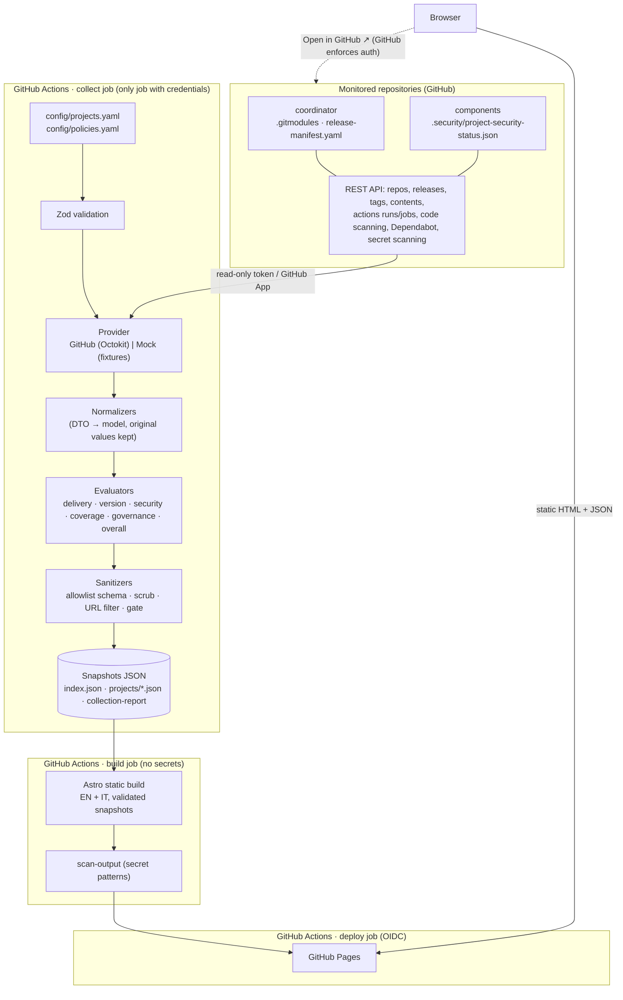

# Architecture

> 🇮🇹 [Versione italiana](it/architecture.md)

## Context

The organisation builds software projects that span many GitHub repositories: a
coordinator ("umbrella") repository with Git submodules, plus application, frontend,
backend, worker, Helm and infrastructure repositories. These share reusable workflows,
composite actions and container images, and are deployed to DEV, TEST, UAT and PROD. GitHub
shows data per repository, per workflow or per organisation. It has no view built around
the **logical project**.

Engineering Project Hub fills that gap with a read-only, static portal. It stays
GitHub-native: code, configuration, data collection (Actions) and hosting (Pages) all live
on GitHub, with no database and no permanent server.

## Overview

## Components

| Component        | Path                         | Responsibility                                                                                                                                                                |
| ---------------- | ---------------------------- | ----------------------------------------------------------------------------------------------------------------------------------------------------------------------------- |
| Model / contract | `shared/model/`              | Zod schemas and TypeScript types for the catalog, policies, external contracts and snapshots. This is the only code shared by the collector and the site.                     |
| Config loader    | `collector/src/config/`      | Parses YAML and validates it with Zod. Errors are reported with exact paths.                                                                                                  |
| Providers        | `collector/src/providers/`   | `SourceProvider` interface. `GitHubProvider` (Octokit with throttling and retry) and `MockProvider` (fixtures). They return `ProviderResult<T>`: data, or a classified error. |
| Collectors       | `collector/src/collectors/`  | Orchestrate provider calls per project, with a concurrency limit and a cache shared across projects.                                                                          |
| Normalizers      | `collector/src/normalizers/` | Map DTOs onto the normalised model: severities, statuses, categories, workflow states, versions, submodules, controls.                                                        |
| Evaluators       | `collector/src/evaluators/`  | Pure health functions, driven by `policies.yaml`. Each result carries reasons.                                                                                                |
| Sanitizers       | `collector/src/sanitizers/`  | Text scrubbing, URL allowlist, final publication gate.                                                                                                                        |
| Writers          | `collector/src/writers/`     | Strict schema validation, gate, then writing the snapshots and the collection report.                                                                                         |
| Site             | `src/`                       | Astro pages (`[...lang]` for EN `/` and IT `/it/`), components, i18n, CSS design tokens, small client scripts (filters, relative times, theme).                               |
| Scripts          | `scripts/`                   | Config and snapshot validation, output secret scan, golden and JSON Schema generation.                                                                                        |

## Data flow

1. **Load and validate** `config/projects.yaml` and `config/policies.yaml`. Invalid config
   stops the run.
2. **Resolve credentials** in this order: GitHub App, `GH_READ_TOKEN`, `GITHUB_TOKEN`,
   then mock only when explicitly selected.
3. **Collect per repository**: metadata, then branch head, latest release (falling back to
   the latest tag), security status file, code scanning alerts and latest analysis,
   Dependabot alerts, and secret scanning alerts (`hide_secret=true`). When the metadata
   call fails, dependent calls are skipped and inherit its classified error.
4. **Collect per project**: the release manifest and `.gitmodules` from the coordinator,
   the submodule SHAs, and the tracked workflow runs (the last 20 on the default branch),
   plus the failed job and step names of the last failed run. Each submodule linked to a
   component is resolved: the component's tags are matched against the pinned SHA, and if
   no tag matches, the SHA is compared with the latest release (ahead / behind / diverged).
5. **Normalise**: provider values become the model's enums. `originalSeverity` and
   `originalStatus` are kept.
6. **Evaluate**: delivery, version, security risk, coverage, governance, freshness and
   overall.
7. **Sanitise and validate**: free text is scrubbed and links are filtered. Every document
   is parsed with the strict schemas (allowlist), then the serialised JSON goes through the
   credential gate. Any failure stops the run before anything is written.
8. **Write** `public/data/index.json`, `projects/<id>.json`, `collection-report.json` and
   `collection-report.md`.
9. **Build** the site. The pages load and re-validate the snapshots at build time. An
   unsupported `schemaVersion` renders a controlled error page.
10. **Scan the output** (`dist/`, `public/data/`) for credential patterns and for the
    values of credentials in the environment, then publish.

## Trust boundaries

| Boundary                 | Controls                                                                                                       |
| ------------------------ | -------------------------------------------------------------------------------------------------------------- |
| GitHub API → collector   | Read-only credentials. Only allow-listed DTO fields are mapped. Raw payloads never leave the provider.         |
| Collector → snapshots    | Strict Zod schemas (unknown keys rejected), text scrubbing, URL host allowlist, credential gate.               |
| Collect job → build job  | Only the sanitised `snapshots` artifact crosses. The build job has no secrets.                                 |
| Build → GitHub Pages     | Output scan. Deploy uses OIDC (`pages: write`, `id-token: write`) only in the deploy job.                      |
| Pages → browser          | Static files only. CSP `default-src 'self'` with no inline scripts. No GitHub API calls. No tokens in storage. |
| Browser → GitHub (links) | GitHub applies its own authorisation. The portal never proxies or bypasses it.                                 |

## Snapshot model

`index.json` (`PortfolioIndex`) has these fields:

- `schemaVersion` and `generatedAt`
- `run`: data source, authentication mode, collector version, timings, per-capability
  availability, inaccessible sources, repository counts, and the policy excerpt (stale
  threshold, audience)
- `projects[]`: a `ProjectSummary` for each project. It holds every dimension status,
  coverage summary, open counts (`null` = unknown), the secret scanning state, failed
  critical workflows, error counts and unresolved submodules.

`projects/<id>.json` (`ProjectSnapshot`) has these fields:

- `project`, `coordinator` (repository, version and source, latest release, manifest
  status, submodules), `components[]`, `environments[]` and `workflows[]`
- `securityFindings[]` (`SecurityFinding`) and `securityControls[]` (repository ×
  control state)
- `deliveryHealth`, `versionHealth`, `securityHealth` (with counts and breakdowns),
  `securityCoverage`, `governanceHealth` and `overallHealth`
- `dataFreshness` and `collectionErrors[]`

Normalised enums:

| Enum             | Values                                                                                                                                   |
| ---------------- | ---------------------------------------------------------------------------------------------------------------------------------------- |
| Health status    | `green`, `amber`, `red`, `grey`                                                                                                          |
| Severity         | `critical`, `high`, `medium`, `low`, `informational`, `unknown`                                                                          |
| Finding status   | `open`, `fixed`, `dismissed`, `accepted-risk`, `false-positive`, `unknown`                                                               |
| Finding category | `code`, `dependency`, `secret`, `container`, `iac`, `dast`, `supply-chain`, `configuration`                                              |
| Control state    | `enabled`, `not-configured`, `configured-not-run`, `not-authorised`, `failed`, `stale`, `unknown`, `collection-failed`, `not-applicable` |
| Error class      | `not-found`, `not-authorised`, `not-configured`, `rate-limited`, `invalid-data`, `error`                                                 |

Generated JSON Schemas are in `config/schema/`. The site supports the snapshot versions
listed in `SUPPORTED_SNAPSHOT_SCHEMA_VERSIONS` (currently `1.0`).

## Health rules (MVP policies)

These are **policies of this MVP**, configurable in `config/policies.yaml`. They are not
universal risk ratings.

- **Delivery**:
  - red when the last completed run of a critical workflow failed or was cancelled
  - amber when a critical workflow is missing, has never run, is stale, has been queued
    longer than the threshold, or only some of its data is available
  - green when every critical workflow's last run succeeded
  - grey when there is no data
- **Version**:
  - red when the manifest references an unknown component, or a submodule cannot be
    resolved
  - amber when the current version (per `versionSource`) differs from the latest release,
    the coordinator pins an untagged SHA, the manifest disagrees with the pinned tag, an
    environment is behind or mismatched, there is an unmapped submodule, or the manifest is
    missing or invalid
  - green when everything is aligned
  - grey when no version can be determined
- **Security risk**:
  - red when there is an open alert at the `redOnSeverities` level (critical by default),
    an open secret alert, or a required control has failed
  - amber when there are high, medium or low alerts, a required scan is stale, coverage is
    incomplete, or counts are partial
  - green only when there are zero open alerts, full coverage and complete data
  - grey when nothing is readable. A known critical is still shown as red.
- **Coverage**: the percentage is computed on **required** controls only, using the worst
  state across the project's repositories. It is never used to hide alerts.
  - green when all required controls are available
  - grey with no percentage when no required control is readable
  - amber otherwise
- **Governance**:
  - amber for a missing standard workflow, an archived repository, a missing or invalid
    status file (when non-native controls are required), or a default branch mismatch
  - grey when no repository is accessible
- **Overall**:
  - red when a critical dimension (delivery, version or security by default) is red
  - amber when any dimension is amber, or a non-critical dimension is red
  - green only when all required dimensions are green
  - grey otherwise, or amber if `greyRequiredDimension: amber`

## Error handling

- Every provider call returns `ProviderResult`. Exceptions are converted to classified
  errors, so one repository can never abort the others.
- **403 is not "no alerts"**: it is `not-authorised`, and the control state becomes
  Not authorised.
- **404 is not "disabled"**. A 404 or 403 whose message says the feature is disabled
  (or "no analysis found") becomes `not-configured`. Any other 404 on a security endpoint
  stays `unknown`. A 404 on a workflow file means the workflow is **missing**, which counts
  against governance. A 404 on a release means there is no release, so the latest tag is
  used.
- Rate limits are retried once when the wait is ≤ 60 s. After that the call is
  `rate-limited`.
- The run fails only for structural reasons: invalid config, missing or partial
  credentials, a snapshot schema violation, or the sanitisation gate.

## Architectural decisions

- [ADR 0001: Static-first, GitHub-native architecture](architecture/adr/0001-static-first-github-native.md)
- [ADR 0002: Snapshot contract and provider abstraction](architecture/adr/0002-snapshot-contract-and-provider-abstraction.md)
- [ADR 0003: Reusable CI building blocks and a collect/build/deploy split](architecture/adr/0003-ci-building-blocks-and-collect-deploy-split.md)

Further decisions:

- Astro SSG renders everything at build time. Client JavaScript only handles filters,
  relative times and the theme toggle, and it is served as external modules
  (`assetsInlineLimit: 0`) so the CSP can forbid inline scripts.
- i18n uses `[...lang]` routes: EN at `/`, IT at `/it/`. The typed dictionaries must have
  identical keys, which is enforced by `Dict` and tested. Snapshots stay language-neutral:
  reasons are codes plus parameters.
- Native CSS design tokens (dark and light themes, WCAG AA contrast). The UI was validated
  with hi-fi mockups before implementation. Fonts are self-hosted Geist (OFL).
- TypeScript is pinned to 6.0 for tooling compatibility (typescript-eslint,
  `@astrojs/check`).
