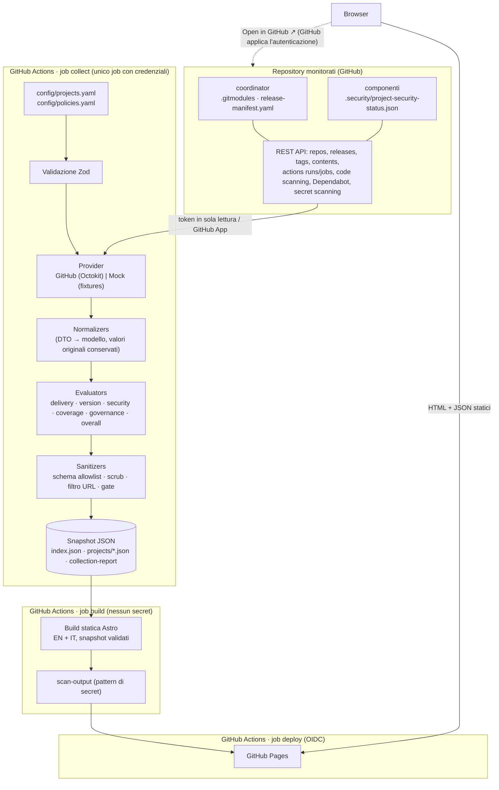

# Architettura

> 🇬🇧 [English version](../architecture.md)

## Contesto

L'organizzazione sviluppa progetti software distribuiti su molti repository GitHub: un
repository coordinator ("umbrella") con Git submodule, più repository applicativi, di
frontend, backend, worker, Helm e infrastruttura. Questi condividono reusable workflow,
composite action e immagini container, e vengono rilasciati in DEV, TEST, UAT e PROD.
GitHub mostra i dati per repository, per workflow o per organizzazione, ma non offre una
vista costruita attorno al **progetto logico**.

Engineering Project Hub colma questa lacuna con un portale statico in sola lettura. Resta
GitHub-native: codice, configurazione, raccolta dati (Actions) e hosting (Pages) risiedono
tutti su GitHub, senza database e senza server permanenti.

## Panoramica

## Componenti

| Componente          | Path                         | Responsabilità                                                                                                                                                                       |
| ------------------- | ---------------------------- | ------------------------------------------------------------------------------------------------------------------------------------------------------------------------------------ |
| Modello / contratto | `shared/model/`              | Schemi Zod e tipi TypeScript per catalogo, policy, contratti esterni e snapshot. È l'unico codice condiviso tra collector e sito.                                                    |
| Config loader       | `collector/src/config/`      | Effettua il parsing dello YAML e lo valida con Zod. Gli errori sono riportati con i path esatti.                                                                                     |
| Provider            | `collector/src/providers/`   | Interfaccia `SourceProvider`. `GitHubProvider` (Octokit con throttling e retry) e `MockProvider` (fixture). Restituiscono `ProviderResult<T>`: i dati oppure un errore classificato. |
| Collector           | `collector/src/collectors/`  | Orchestrano le chiamate ai provider per progetto, con un limite di concorrenza e una cache condivisa tra i progetti.                                                                 |
| Normalizer          | `collector/src/normalizers/` | Mappano i DTO sul modello normalizzato: severità, stati, categorie, stati dei workflow, versioni, submodule, controlli.                                                              |
| Evaluator           | `collector/src/evaluators/`  | Funzioni di salute pure, guidate da `policies.yaml`. Ogni risultato riporta i motivi.                                                                                                |
| Sanitizer           | `collector/src/sanitizers/`  | Pulizia del testo, allowlist degli URL, gate finale di pubblicazione.                                                                                                                |
| Writer              | `collector/src/writers/`     | Validazione strict degli schemi, gate, quindi scrittura degli snapshot e del collection report.                                                                                      |
| Sito                | `src/`                       | Pagine Astro (`[...lang]` per EN `/` e IT `/it/`), componenti, i18n, token CSS (design token), piccoli script client (filtri, tempi relativi, tema).                                 |
| Script              | `scripts/`                   | Validazione di config e snapshot, secret scan dell'output, generazione dei golden e degli JSON Schema.                                                                               |

## Flusso dei dati

1. **Caricamento e validazione** di `config/projects.yaml` e `config/policies.yaml`. Una
   config non valida interrompe l'esecuzione.
2. **Risoluzione delle credenziali** in quest'ordine: GitHub App, `GH_READ_TOKEN`,
   `GITHUB_TOKEN`, poi mock solo se selezionato esplicitamente.
3. **Raccolta per repository**: metadati, poi head del branch, ultima release (con
   fallback sull'ultimo tag), file di stato sicurezza, alert di code scanning e ultima
   analisi, alert Dependabot e alert di secret scanning (`hide_secret=true`). Se la
   chiamata dei metadati fallisce, le chiamate dipendenti vengono saltate ed ereditano il
   suo errore classificato.
4. **Raccolta per progetto**: il release manifest e `.gitmodules` dal coordinator, gli SHA
   dei submodule e le esecuzioni dei workflow monitorati (le ultime 20 sul branch
   predefinito), più i nomi del job e dello step falliti nell'ultima esecuzione fallita.
5. **Normalizzazione**: i valori dei provider diventano gli enum del modello.
   `originalSeverity` e `originalStatus` vengono conservati.
6. **Valutazione**: delivery, versioni, rischio sicurezza, copertura, governance,
   aggiornamento dei dati e stato complessivo.
7. **Sanitizzazione e validazione**: il testo libero viene ripulito e i link vengono
   filtrati. Ogni documento è sottoposto a parsing con gli schemi strict (allowlist), poi il
   JSON serializzato passa per il gate delle credenziali. Qualsiasi errore interrompe
   l'esecuzione prima che venga scritto qualcosa.
8. **Scrittura** di `public/data/index.json`, `projects/<id>.json`,
   `collection-report.json` e `collection-report.md`.
9. **Build** del sito. Le pagine caricano e rivalidano gli snapshot in fase di build. Uno
   `schemaVersion` non supportato produce una pagina di errore controllata.
10. **Scansione dell'output** (`dist/`, `public/data/`) alla ricerca di pattern di
    credenziali e dei valori delle credenziali presenti nell'ambiente, quindi
    pubblicazione.

## Confini di fiducia

| Confine                 | Controlli                                                                                                                        |
| ----------------------- | -------------------------------------------------------------------------------------------------------------------------------- |
| API GitHub → collector  | Credenziali in sola lettura. Vengono mappati solo i campi DTO in allowlist. I payload grezzi non escono mai dal provider.        |
| Collector → snapshot    | Schemi Zod strict (chiavi sconosciute rifiutate), pulizia del testo, allowlist degli host URL, gate delle credenziali.           |
| Job collect → job build | Passa solo l'artifact sanitizzato `snapshots`. Il job build non ha secret.                                                       |
| Build → GitHub Pages    | Scansione dell'output. Il deploy usa OIDC (`pages: write`, `id-token: write`) solo nel job deploy.                               |
| Pages → browser         | Solo file statici. CSP `default-src 'self'` senza script inline. Nessuna chiamata all'API di GitHub. Nessun token nello storage. |
| Browser → GitHub (link) | GitHub applica la propria autorizzazione. Il portale non la inoltra né la aggira mai.                                            |

## Modello degli snapshot

`index.json` (`PortfolioIndex`) contiene questi campi:

- `schemaVersion` e `generatedAt`
- `run`: sorgente dati, modalità di autenticazione, versione del collector, tempi,
  disponibilità per capability, sorgenti non accessibili, conteggi dei repository e
  l'estratto delle policy (soglia di dato non aggiornato, pubblico)
- `projects[]`: un `ProjectSummary` per ciascun progetto. Contiene lo stato di ogni
  dimensione, il riepilogo della copertura, i conteggi degli elementi aperti
  (`null` = sconosciuto), lo stato del secret scanning, i workflow critici falliti, i
  conteggi degli errori e i submodule non risolti.

`projects/<id>.json` (`ProjectSnapshot`) contiene questi campi:

- `project`, `coordinator` (repository, versione e relativa fonte, ultima release, stato
  del manifest, submodule), `components[]`, `environments[]` e `workflows[]`
- `securityFindings[]` (`SecurityFinding`) e `securityControls[]` (repository × stato del
  controllo)
- `deliveryHealth`, `versionHealth`, `securityHealth` (con conteggi e suddivisioni),
  `securityCoverage`, `governanceHealth` e `overallHealth`
- `dataFreshness` e `collectionErrors[]`

Enum normalizzati:

| Enum                  | Valori                                                                                                                                   |
| --------------------- | ---------------------------------------------------------------------------------------------------------------------------------------- |
| Stato di salute       | `green`, `amber`, `red`, `grey`                                                                                                          |
| Severità              | `critical`, `high`, `medium`, `low`, `informational`, `unknown`                                                                          |
| Stato del finding     | `open`, `fixed`, `dismissed`, `accepted-risk`, `false-positive`, `unknown`                                                               |
| Categoria del finding | `code`, `dependency`, `secret`, `container`, `iac`, `dast`, `supply-chain`, `configuration`                                              |
| Stato del controllo   | `enabled`, `not-configured`, `configured-not-run`, `not-authorised`, `failed`, `stale`, `unknown`, `collection-failed`, `not-applicable` |
| Classe di errore      | `not-found`, `not-authorised`, `not-configured`, `rate-limited`, `invalid-data`, `error`                                                 |

Gli JSON Schema generati si trovano in `config/schema/`. Il sito supporta le versioni di
snapshot elencate in `SUPPORTED_SNAPSHOT_SCHEMA_VERSIONS` (attualmente `1.0`).

## Regole di salute (policy dell'MVP)

Queste sono **policy di questo MVP**, configurabili in `config/policies.yaml`. Non sono
valutazioni del rischio universali.

- **Delivery**:
  - rosso quando l'ultima esecuzione completata di un workflow critico è fallita o è stata
    annullata
  - ambra quando un workflow critico manca, non è mai stato eseguito, non è aggiornato, è
    in coda da più tempo della soglia, oppure solo una parte dei suoi dati è disponibile
  - verde quando l'ultima esecuzione di ogni workflow critico è riuscita
  - grigio quando non ci sono dati
- **Versioni**:
  - rosso quando il manifest fa riferimento a un componente sconosciuto, oppure un
    submodule non può essere risolto
  - ambra quando c'è drift su un componente, un ambiente è indietro o non coerente, c'è un
    submodule non associato, oppure il manifest manca o non è valido
  - verde quando tutto è allineato
  - grigio quando non è possibile determinare alcuna versione
- **Rischio sicurezza**:
  - rosso quando c'è un alert aperto al livello `redOnSeverities` (critical per
    impostazione predefinita), un alert di secret aperto, oppure un controllo obbligatorio
    è fallito
  - ambra quando ci sono alert high, medium o low, una scansione obbligatoria non è
    aggiornata, la copertura è incompleta oppure i conteggi sono parziali
  - verde solo con zero alert aperti, copertura completa e dati completi
  - grigio quando nulla è leggibile. Un critical noto viene comunque mostrato in rosso.
- **Copertura**: la percentuale è calcolata solo sui controlli **obbligatori**, usando lo
  stato peggiore tra i repository del progetto. Non viene mai usata per nascondere alert.
  - verde quando tutti i controlli obbligatori sono disponibili
  - grigio senza percentuale quando nessun controllo obbligatorio è leggibile
  - ambra negli altri casi
- **Governance**:
  - ambra per un workflow standard mancante, un repository archiviato, un file di stato
    mancante o non valido (quando sono richiesti controlli non nativi), oppure un branch
    predefinito non corrispondente
  - grigio quando nessun repository è accessibile
- **Complessivo**:
  - rosso quando una dimensione critica (per impostazione predefinita delivery, versioni o
    sicurezza) è rossa
  - ambra quando una qualsiasi dimensione è ambra, oppure una dimensione non critica è rossa
  - verde solo quando tutte le dimensioni obbligatorie sono verdi
  - grigio negli altri casi, oppure ambra se `greyRequiredDimension: amber`

## Gestione degli errori

- Ogni chiamata a un provider restituisce `ProviderResult`. Le eccezioni sono convertite in
  errori classificati, così un repository non può mai interrompere gli altri.
- **403 non significa "nessun alert"**: è `not-authorised` e lo stato del controllo diventa
  Not authorised (Non autorizzato).
- **404 non significa "disabilitato"**. Un 404 o 403 il cui messaggio indica che la
  funzionalità è disabilitata (oppure "no analysis found") diventa `not-configured`.
  Qualsiasi altro 404 su un endpoint di sicurezza resta `unknown`. Un 404 su un file di
  workflow significa che il workflow è **mancante**, il che pesa sulla governance. Un 404 su
  una release significa che non esiste alcuna release, quindi viene usato l'ultimo tag.
- I rate limit vengono ritentati una volta quando l'attesa è ≤ 60 s. Dopodiché la chiamata
  è `rate-limited`.
- L'esecuzione fallisce solo per motivi strutturali: config non valida, credenziali
  mancanti o parziali, una violazione dello schema degli snapshot oppure il gate di
  sanitizzazione.

## Decisioni architetturali

- [ADR 0001: Architettura static-first e GitHub-native](architecture/adr/0001-static-first-github-native.md)
- [ADR 0002: Contratto degli snapshot e astrazione dei provider](architecture/adr/0002-snapshot-contract-and-provider-abstraction.md)
- [ADR 0003: Mattoni CI riusabili e separazione collect/build/deploy](architecture/adr/0003-ci-building-blocks-and-collect-deploy-split.md)

Altre decisioni:

- Astro SSG genera tutto in fase di build. Il JavaScript lato client gestisce solo filtri,
  tempi relativi e il cambio di tema, ed è servito come moduli esterni
  (`assetsInlineLimit: 0`), così la CSP può vietare gli script inline.
- L'i18n usa le route `[...lang]`: EN su `/`, IT su `/it/`. I dizionari tipizzati devono
  avere chiavi identiche, vincolo imposto da `Dict` e verificato dai test. Gli snapshot
  restano indipendenti dalla lingua: i motivi sono codici più parametri.
- Design token in CSS nativo (tema scuro e chiaro, contrasto WCAG AA). La UI è stata
  validata con mockup hi-fi prima dell'implementazione. I font sono Geist self-hosted (OFL).
- TypeScript è fissato alla 6.0 per compatibilità con il tooling (typescript-eslint,
  `@astrojs/check`).
